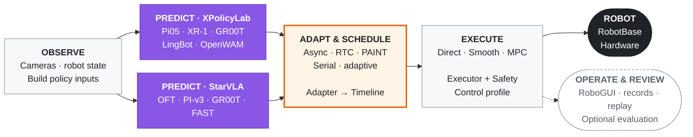

<div align="center">

# ManiMux

**Build your policy. Bring your robot. Run your research.**

A composable framework for real-robot inference and experiments.

**Policy × Runtime × Embodiment**

[](LICENSE)
[](pyproject.toml)
[](#robogui)
[](.agents/skills/manimux-development/SKILL.md)

[English](README.md) · [简体中文](README.zh-CN.md)

[Quick start](#quick-start) · [Architecture](#architecture) · [Integrate](#integrate) · [Documentation](docs/README.md) · [Citation](#citation)

</div>

ManiMux lets researchers reuse one execution and experiment workflow across policies,
inference strategies and robot embodiments. Configure the components, start the services,
and operate your experiment in **RoboGUI**. Extend the part your research changes through
an explicit protocol; keep the rest of the stack.

| Shared foundation | What you can do |
| --- | --- |
| Configurable deployment | Compose a policy framework, action adapter, inference strategy, executor and robot |
| One runtime | Reuse observation handling, asynchronous inference, action timelines and rollout lifecycle |
| RoboGUI | Prepare, start, pause and finish; inspect cameras, 3D state, trajectories and chunk handoffs |
| Research workflow | Run freely or apply your own layout/repetition template; review saved rollouts |
| Agent-ready integration | Give your agent the owning interface, configuration path and validation example |

Evaluation is optional. Use your own research protocol and metrics; human labels and
PRM-as-a-Judge are available when needed. Model training and demonstration collection
remain with external tools.

## RoboGUI


[▶ Watch the real-robot demo](assets/manimux_2026-09-05_23-17-35-00.00.03.144-00.00.34.914-seg1-00.00.02.596-00.00.34.966.mp4)

**Prepare → Start → Pause / Finish → Review.** Free rollouts need no scoring.
Study rollouts can use a template and optional evaluation. Recorded trajectories replay
in a separate, hardware-free view. [Research workflow →](docs/usage/research.md)

## Architecture

Model frameworks own inference. ManiMux owns observation/action adaptation, scheduling,
execution and experiment operation. Strategies decide when to request and hand off chunks;
executors turn timeline references into commands.



XPolicyLab and StarVLA have independent serving environments and ManiMux clients.
A new framework can implement the same client interface. A new robot implements component
and assembly protocols. [Extension map →](docs/development/README.md)

## Quick start

### Explore without hardware

Python 3.11 or 3.12 and [uv](https://docs.astral.sh/uv/) are required for these commands:

```bash
git clone https://github.com/SII-LiuLab/manimux.git
cd manimux
uv sync --dev
uv run manimux-viewer --robot yam --demo --host 127.0.0.1 --port 8086
```

Open **http://127.0.0.1:8086**. This demo displays synthetic data and the bundled YAM
model; it does not connect to a robot. Model-framework submodules and checkpoints are
only needed for the deployment path you choose.

### Run on your robot

1. Select a [model/robot runbook](docs/reference/README.md#policies-and-deployment)
   and prepare its hardware and model environments.
2. Bind devices, service addresses and checkpoint paths in your private
   [station file](manimux/configs/local/README.md).
3. Start the camera, RoboGUI, model server and runtime using the
   [complete Pi05/YAM example](docs/reference/guideline.md#pi05-30k-on-yam)
   or the selected model's runbook.
4. Continue in RoboGUI: enter your task, prepare and run trials, then review records.

`manimux serve` keeps the service available for repeated GUI-driven rollouts.
`manimux run` executes one rollout. Preparation can connect and move the selected robot
as configured; use the runbook matching your actual setup.

[Configuration explained](manimux/configs/README.md) · [Annotated experiment](manimux/configs/examples/README.md)

## Integrate

**For users:** configure an existing combination and use RoboGUI.
**For your coding agent:** start at [AGENTS.md](AGENTS.md), then load the relevant skill.

| Task | Entry point |
| --- | --- |
| Add a robot, gripper or camera | [Component protocols](docs/development/components.md) |
| Add a model, framework or action adapter | [Policy protocols](docs/development/policies.md) |
| Add scheduling, execution or a GUI feature | [Runtime protocols](docs/development/runtime-config.md) |
| Connect supported hardware at another lab | [Station setup skill](.agents/skills/manimux-station-setup/SKILL.md) |
| Analyze your recorded experiments | [Experiment skill](.agents/skills/manimux-experiments/SKILL.md) |

Each integration documents its input/output semantics, owning files, YAML selection and
validation. [Contributing](CONTRIBUTING.md) explains the expected handoff.

## Support and evidence

See the [support catalog](docs/reference/README.md) for model, hardware and method
runbooks. Capabilities vary by checkpoint and backend; an integration does not imply
that every model × robot × algorithm combination has been tested on hardware.
ManiMux is under active development. Our own [study register](docs/experiments.md)
and validation reports describe the evidence behind specific configurations.

## Citation

If ManiMux supports your research, cite the repository. For work using XPolicyLab,
please also cite its paper and the models/methods you use.

```bibtex
@misc{manimux2026,
  title = {{ManiMux}: A Composable Platform for Real-Robot Experiments},
  year = {2026},
  howpublished = {GitHub repository},
  url = {https://github.com/SII-LiuLab/manimux}
}

@article{community2026xpolicylab,
  title = {{XPolicyLab}: A Unified Standard and Open Ecosystem for Robot Policy Evaluation and Deployment},
  author = {{XPolicyLab Community} and Chen, Tianxing and Chen, Yue and Nian, Tian and others},
  journal = {arXiv preprint arXiv:2608.09892},
  year = {2026},
  doi = {10.48550/arXiv.2608.09892},
  url = {https://arxiv.org/abs/2608.09892}
}
```

[Third-party notices](THIRD_PARTY_NOTICES.md) · [Upstream licenses](licenses) · [Documentation](docs/README.md)

## License

ManiMux is licensed under [MIT](LICENSE). Third-party frameworks, SDKs and assets
retain their own licenses; see [third-party notices](THIRD_PARTY_NOTICES.md).
